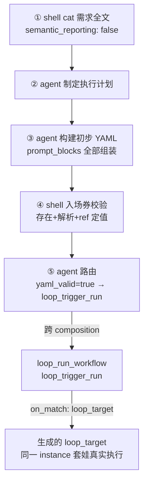

# Loop Engineering 配置框架（草案）

用 OpenRY 自身的 Composition/Workflow YAML 搭建的**标准迭代循环**（对应 `design/phase3f-loop-engineering.md`）。

**当前范围**：
- 播种阶段（合并后的 `loop_bootstrap`）：shell 读需求 → agent 计划 → agent 构建初步 YAML（纯 `kind: agent`）→ 入场券校验 → 路由
- 运行第一步（`loop_run_workflow`）：套娃运行生成的 `loop_target`

失败分析 / 修复 / 归档等后续迭代步骤待实现。

## 1. 总体架构（当前）



只触发一次 `loop_bootstrap` 即可跑完整条链。

## 2. 设计哲学（详见 `config-building-guide.md`）

1. **验证生成物 = 真实运行生成物本身**：静态校验只是入场券，套娃真实运行才是最终验证
2. **初步构建从简**：生成的 YAML 全部 `kind: agent` + 自然语言描述，不写 shell 细节；
   不确定性交给迭代循环「边做边改」

## 3. 定值约定 loop_target

`on_match` 暂不支持变量（路由目标是字面量，见 `router.ts` / `cli.py`），因此采用**定值 ref**：

- 生成器提示词（`loop_seed_build.build_initial_yaml` 的 prompt_blocks）写死：
  - `~/.openry/workflows/loop_target.yaml`，`name` 字段必须是 `loop_target`
  - `~/.openry/compositions/loop_target.yaml`，`big_steps` 第一个 `ref` 必须是 `loop_target`
- **入场券（定值修复）**：`verify_seed_yaml`（shell 确定性检查）把「name/首个 ref」就地修复为定值
  `loop_target`，结构不可修才 `yaml_valid=false`，回构建步骤重写
- `loop_trigger_run` 的条件路由 `on_match: loop_target` 与上述约定一致
- 套娃语义：跳转发生在**同一 workflow instance**（Phase 3f `routeToBigStep`），
  `loop_run_workflow` 的 `big_steps` 静态列出 `ref: loop_target`，
  `findCompositionContaining` 优先命中当前 composition，链不会降级 standalone

## 4. 文件清单

| 文件 | 作用 |
|------|------|
| `compositions/loop_bootstrap.yaml` | 播种阶段（合并了原 intake + plan_generate） |
| `compositions/loop_run_workflow.yaml` | 运行阶段（第一步：套娃运行产物） |
| `workflows/loop_seed_build.yaml` | 读需求 → 计划 → 构建 → 入场券 → 路由 |
| `workflows/loop_trigger_run.yaml` | echo 开始了 + 上报 run_time/ref + 套娃跳转 |
| `workflows/loop_target.yaml` | **由生成器产出**（定值 slot，不在本仓库维护） |
| `config-building-guide.md` | 配置构建思路指南（怎么想，不断总结更新） |

## 5. payload 线程（跨 sub_step / big_step 传递的关键 key）

| key | 生产 | 消费 |
|-----|------|------|
| `_stdout`（需求全文） | ① shell cat | ② 计划 agent |
| `plan_text` | ② 计划 agent | ③ 构建 agent |
| `yaml_valid` | ③ 构建 / ④ 入场券 | ⑤ 路由 |
| `ref`（定值 loop_target） | ④ 入场券 | ⑤ 路由 / trigger 条件路由 |
| `run_time` | trigger（=1） | trigger 条件路由 |

> 注意：agent 步骤落库 payload = agent 上报内容（**不自动合并**），所以每个
> agent 步骤的 description 都明确要求「原样回传」需要保留的 key；
> shell 步骤只保留 stdout 提取的 key，所以必须把需传递的 key 打进 stdout JSON。

## 6. 安装与运行

```bash
# 1. 安装框架 YAML（覆盖到 OPENRY_HOME，默认 ~/.openry）
cp loop-engineering/compositions/*.yaml ~/.openry/compositions/
cp loop-engineering/workflows/*.yaml    ~/.openry/workflows/

# 2. 准备需求文档（纯自然语言，全文原样读取）
mkdir -p ~/.openry/agent-workspace/loop
cp loop-engineering/requirement.md.example ~/.openry/agent-workspace/loop/requirement.md
#   …然后编辑 requirement.md 填入真实需求…

# 3. 触发整条链路（需保证 openclaw gateway 运行中——patrol 由 orchestrator-plugin 执行）
openry-orchestrator start loop_bootstrap
```

**前提**：`loop_run_workflow` 依赖 `loop_target.yaml` 已生成（由 `loop_bootstrap`
产出），单独跑运行环节前必须先完成播种阶段。

## 7. 待实现（后续步骤）

- `loop_analyze_failure` / `loop_fix_yaml` / `loop_finalize`（失败分析 / 修复 / 归档，迭代闭环）
- `report_result` 契约收紧：`step_ok=false` → 路由 `loop_analyze_failure`（迭代环节加入后）
- `_loop_iteration` 迭代计数与 `max_iterations` 上限
- `on_match` 动态变量支持（可选代码改动）
- 蒸馏跳过分支的下游释放 patch（见第 8 节第 2 条）

## 8. 已知限制

1. **on_match 不支持变量** → 采用定值 `loop_target`（生成器写死 + 入场券硬验证）。
   若要动态导入，需在 `openry/cli.py:_evaluate_routing_sync` 与
   `orchestrator-plugin/src/orchestrator/router.ts` 增加 `${payload.key}` 模板替换。
2. ~~shell 跳过蒸馏的下游等待~~（已实测修正）：`semantic_reporting: false` 时
   下游**立即执行**——patrol 顺序 `scanAndCompress` 先于 `routeValidated`，源 step
   先被标记 `_compressed: true`，下游入队时继承的就是 true，无等待。
   （`forceTimeoutQueued` 5 分钟兜底只覆盖蒸馏真在跑且未完成的场景。）
3. `loop_run_workflow` 依赖 `loop_target.yaml` 已生成。
4. `kind: shell` 不评估 `validation_routing`，所有路由决策点必须用 `kind: agent`。
5. 构建往返（`route_to_run → build_initial_yaml`）无计数上限，靠 big_step 超时兜底。
6. prompt_blocks 引用的文档是绝对路径（`docs/` 与 `loop-engineering/`），换机器需改。


