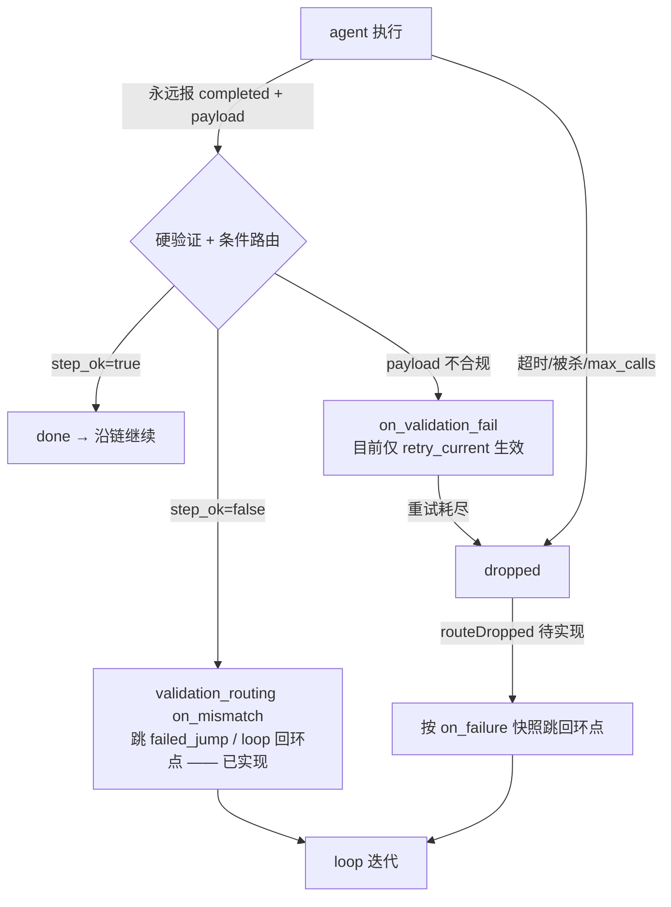
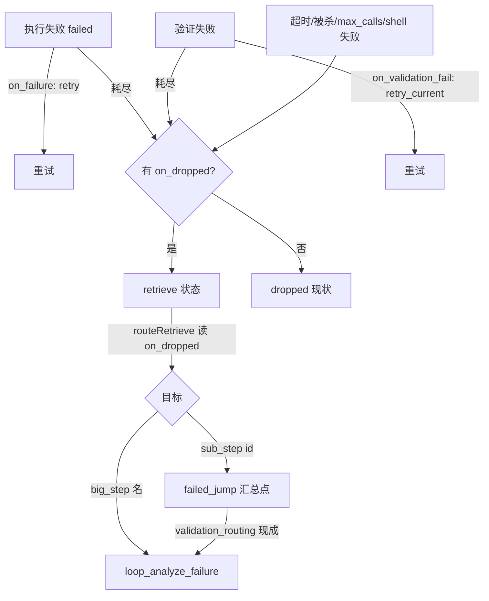

# Loop 失败路由模型（设计留档）

> 日期：2026-08-14
> 状态：讨论稿（部分已实测，实测结论随文标注）
> 关联文档：
> - `config-building-guide.md` —— 构建思路（怎么想）
> - `docs/compositions-and-workflows-guide.md` —— 字段手册（有什么）
> - `analysis-source-ladder.md` —— 分析步数据源阶梯（自取什么，2026-08-17 定稿）
> - `iteration-canonical-form.md` —— 迭代产物规范形（怎么写，2026-08-17 定稿）

---

## 1. 概念分层：执行状态 / 验证结果 / 最终态

loop 设计的目标是把"执行"与"结果判断"解耦：

| 概念 | 取值 | 对应实现 |
|------|------|---------|
| **执行状态 status** | complete（干完了）/ uncomplete（没干完） | `task_state.status`：`completed` vs `failed`/`cancelled`/`overflow`（过程态 `queued`/`in_progress` 不算） |
| **验证结果** | successful / failed | `validation_status: passed / failed` + payload 中 agent 自报的 `step_ok` |
| **最终态** | done / dropped | `done` = 已路由继续；`dropped` = 死亡终点（唯一需要"回环"处理的状态） |

## 2. 两层视角

**契约层**（agent 行为约定，loop 框架可以立即采用）：
- agent 永远只上报 `completed`，成败写进 payload（`step_ok: true/false` + `error`）
- `--status failed` 从契约中消失

**状态机层**（底层实现，不能删）：
- 超时软刹车 → `cancelled`、max_tool_calls 超限 → `failed`、进程崩溃等系统死亡路径仍需状态表达
- 这些路径最终也汇入 `dropped`

## 3. 两个失败入口、一个回环出口

- 自报失败 → `validation_routing`（现成可用）
- 上报不合规 → `on_validation_fail`（目前只有 `retry_current`）
- 系统死亡 → dropped → `routeDropped` 总漏斗（待实现）

## 4. on_failure 与 on_validation_fail 的区别（实测）

| 维度 | `on_failure` | `on_validation_fail` |
|------|-------------|---------------------|
| 触发时机 | agent 上报 `--status failed`（执行失败） | agent 上报 completed 但硬验证不过（payload 缺 key / validation 规则失败） |
| 当前生效值 | 仅 `retry`（需 `max_sub_step_retries`，耗尽 dropped） | 仅 `retry_current`（同样受预算限制） |
| 其他值 | 一律 dropped（含 `abort`、sub_step `id`） | 一律 dropped（含 `abort`、sub_step `id`） |
| 三引擎一致性 | cli.py / engine.py / patrol.ts 一致 | CLI + patrol 一致 |
| sub_step 跳转 | ❌ 从未实现 | ❌ 从未实现 |

**实测记录**：
- 2026-08-14 `test_onfailure_jump`：`on_failure: after_fail` 不生效。openry_status 返回
  `{"action":"dropped","reason":"on_failure=abort，任务终止"}`，after_fail 未触发。
- 2026-08-14 `test_vfail_routing`：`on_validation_fail: after_vfail` 不生效。上报 completed
  但缺 `required_key` 时返回 `{"action":"dropped","reason":"验证失败，on_validation_fail=abort（缺少必填字段...）"}`——
  reason 硬编码 “abort”，即使配置的是 after_vfail；`on_failure` 在此路径完全未被读取；
  after_vfail 未触发。**结论：验证失败与执行失败两条路径都不支持 sub_step 跳转。**
- 2026-08-14 `test_vfail_retry`（对照组）：✅ `retry_current` 生效。第一次返回
  `{"action":"validation_failed_retry","retry":"1/2"}`（会话继续），第二次返回
  `{"action":"dropped"}`（重试耗尽）。

**实测矩阵（2026-08-14 全部坐实）**：

| 场景 | 配置 | 实测结果 |
|------|------|--------|
| 执行失败 | `on_failure: <sub_step_id>` | ❌ dropped（reason 硬编码 on_failure=abort） |
| 执行失败 | `on_failure: retry` + 预算 | ✅ 重试（代码确认，CLI _handle_failed_retry） |
| 验证失败 | `on_validation_fail: <sub_step_id>` | ❌ dropped（reason 硬编码 on_validation_fail=abort） |
| 验证失败 | `on_validation_fail: retry_current` + 预算 | ✅ 重试 1/2 → 耗尽 dropped |

> 结论：失败侧（执行失败/验证失败）目前**没有任何 sub_step / big_step 跳转能力**，
> 只有重试。routeDropped + 验证失败路由是 loop 闭环的必修项。

## 5. on_dropped + retrieve 状态方案（已实现 · 2026-08-17）

已拍板决策：
1. YAML 新增可选字段 `on_dropped`：**存在即开关，值即目标**；不配置 = 现状（dropped 不路由）
2. 新状态值命名为 **`retrieve`**（= 已失败，待回收路由）
3. 目标语法对齐 validation_routing：`abort`（默认）/ 同 big step sub_step id /
   `big_step_name` / `big_step_name:sub_step`
4. **方案乙**：CLI 只负责「有 on_dropped → 置 retrieve；无 → dropped」；
   目标解析与路由执行统一由 patrol 一处完成

**核心机制**：
- 失败终态三分：`dropped`（不路由，现状）/ `retrieve`（待路由，新）/ `done`（消费后）
- patrol 新增 `routeRetrieve()`（排在 retryFailed 之前）：扫 `status='retrieve'` →
  现场 `loadBigStep` 读 `on_dropped` → 目标解析（对齐 validation_routing 优先级）→
  `enqueueNextSubStep`（同 big step）或 `routeToBigStep`（跨 big step）→ 原任务置 done；
  无效目标降级 dropped + 日志。
- payload 传递：目标 sub_step 配 `inherit_payload: true` 时收到失败任务完整 payload
  （实测：agent 报失败/验证失败/max_calls 路径均有内容；shell 失败路径上游 seed 丢失，
  目标必须查 DB 兑底）。
- 防死循环：每个 retrieve 只消费一次；环内收敛靠 loop `max_iterations`；
  建议环上至少一个成员 `on_dropped` 指向环外（abort / loop_finalize）。
- 实例收尾：routeRetrieve 末尾通用检查（running 实例无活任务→含 retrieve→failed），
  顺带修复 CLI 直接 dropped 实例卡 running 的历史问题（实例 17/18/19）。
- 超时路径：当前检测未武装（big_step_started_at 全库 NULL）；将来武装后其死亡路径
  经 failed → retryFailed 自动获得同一开关处理，无需再改。

**实测验证（2026-08-17，6/6 通过）**：
- test_onfailure_jump / test_vfail_routing：同 big step 回收路由 ✓
- test_drop_shell / test_drop_maxcalls：死亡路径回收路由 + payload 继承 ✓
- test_drop_invalid_target：无效目标降级 dropped + 实例收尾 failed ✓
- test_drop_crossbigstep：跨 big_step 回环（跳转 loop_seed_build 真实执行，
  composition 列重写为 loop_bootstrap，实例 completed）✓
- 历史卡 running 实例 17/18 由 reapDeadInstances 自动收尾 ✓

### 5.1 dropped 时 payload 有没有内容？（DB 实测 2026-08-14）

| dropped 成因 | payload 里有什么 | 实测证据 |
|------|------|------|
| agent 主动 `--status failed --payload {...}` | ✅ 有：CLI failed 分支先落库 payload 再置 dropped | 实例 17 `fail_step`：`{"error": "deliberate_failure_test", "from": "fail_step"}` 完整保留 |
| 验证失败 / 验证重试耗尽 | ✅ 有：completed 分支已落库提交的 payload（只是缺 key 不合规） | 实例 18/19：`{"other": 1, "_compressed": true}` |
| 超时软刹车 → cancelled → 被杀 | ⚠️ **实测发现：超时检测本身未武装**。`workflow_instances.big_step_started_at` 从未被任何代码写入（全库 NULL，2026-08-14 实测），`queryTimedOutTasks` 要求该列非 NULL → 永远为空，`timeout_minutes` 形同虚设。待测：修复 armed 后再测 |
| max_tool_calls 超限被砍 | ✅ 实测（实例 20）：payload = 入队继承的上游 payload（含 `_inherits_from_run_id`），上游上下文完整保留；实例经 failed 正确收尾为 failed |
| shell 失败 / agent 会话崩溃 | ⚠️ 实测（实例 21）：payload = **stdout 派生内容**（`{"_stdout": 部分输出, "_compressed": false}`）——patrol 的 shell close handler 无条件用 buildStdoutPayload 覆盖 payload，**入队继承的 seed 被覆盖丢失**；stderr 只进 commands_log。目标 step 若需要上游上下文必须查 DB |
| retry 耗尽（on_failure: retry 用光预算） | ✅ 实测（实例 33）：payload = **最后一次提交**（`{"error":"retry_exhaust_test","attempt":2}`）——非空、非第一次；on_dropped 路由后 after_fail 完整继承（error/attempt 原样到达） |
| agent 自报 cancelled | ❌ 实测（实例 34）：payload = **空 `{}`**——CLI cancelled 分支只改状态不落 payload（agent 提交的 `{"error":"cancel_test_payload"}` 丢失）；目标 after_cancel 实测上报 `{"error":null,"has_error_key":false}`，证实「cancelled 路径 payload 不可信」 |
| 命令级超时（openry_run 长命令被 600s 超时杀） | ❌ 实测（实例 35）：payload = **空 `{}`**；**commands_log 零记录**（openry CLI 被 SIGTERM 时未写出执行记录）；agent 会话同刻被 gateway turn 超时击杀（session status=killed，runtimeMs≈604s），根本没机会上报任何内容 |

**附加发现（2026-08-14 DB 实测）**：CLI 直接置 dropped 的实例（17/18/19）
`workflow_instances.status` 永远卡在 `running`——`retryFailed` 只处理 status='failed'
的行，看不到 CLI 直接写的 dropped，实例级状态死半路。on_dropped 补丁需要同步处理
实例收尾（无活任务 → 标记 failed）。

**结论（8 条路径全实测，2026-08-17 补完）**：payload 可靠 4 条（agent 报 failed /
验证失败耗尽 / max_calls 继承 / retry 耗尽最后一次提交），不可靠 4 条（shell 失败
stdout 覆盖 seed / cancelled 空 / 命令级超时空且 commands_log 零记录 / big_step 超时
未武装待测）。迭代双保险不变：
1. 路由时把 dropped 任务的 payload 照传（有 error 就带上）
2. 目标 sub_step（loop_analyze）自己查 DB 补全失败原因（commands_log 执行记录 +
   task_state 历史）——loop 契约要求分析步骤必须查 DB，不能只信 payload

### 5.1a `openry_run` 同步阻塞 gateway 事件循环（Bug · 2026-08-17 实测定位）

`openry_run` 工具在 gateway **主线程**上用 `execSync` 同步执行命令
（`orchestrator-plugin/src/index.ts` execOpenry，超时 `commandTimeoutSeconds` 默认 600s）。
实例 35 实测（agent 执行 `openry_run 'sleep 900'`）的完整证据链：
- 14:54:04.956 agent 发起工具调用 → gateway 事件循环**整体冻结**：patrol 5s 定时器
  停摆、日志零输出、其它实例的 queued 任务全部停摆（实例 34 的 after_cancel 在
  queued 里躺了整整 10 分钟）
- 15:04:05 解冻（600.16s 后）：transcript toolResult = `spawnSync /bin/sh ETIMEDOUT`
  （execSync 自身的 600s 超时触发）；同刻 patrol 拖欠周期立即运行 → dispatch
  after_cancel（15:04:05.011）；gateway 判定 agent turn 超时 → "LLM request timed
  out." → agent 进程 exit 143、会话 status=killed
- **超时双层**：实测触发的是插件 execSync 的 600s（`ETIMEDOUT`）；CLI 内部 600s
  （`openry -c` 默认 600）被永远遮挡，从未真正行使
- **对 Loop 工程的影响**：任何长 shell（训练/长编译/长下载）都会冻结整个编排调度，
  包括其他并发实例 —— 必修项：`openry_run` 改异步 spawn + 完成回写（命令期间
  gateway 继续巡逻），见第 6 节改动 #8

**失败分析数据源实测（2026-08-17，实例 32 test_fail_process）**：
- ✅ 失败步骤 payload 有内容（agent 提交的 error/stage 完整落库）
- ✅ retrieve 路由 payload 照传（after_fail 收到 error + stage）
- ✅ commands_log 行动轨迹完整：agent 的 openry_run 命令全量落库（命令/cwd/退出码/
  全量 stdout/耗时，按 id 有序；shell 步骤仅存前 2KB）——可重建「动作过程」
- ✅ transcript 反查链路可用：sessions.json 的 key 含 `:run:{run_id}` → sessionId →
  `~/.openclaw/agents/openry-worker/sessions/{sessionId}.jsonl`（消息级，~20KB/step）
  与 `.trajectory.jsonl`（事件级，~145KB/step）
- 数据源分层建议：① commands_log + payload（行动轨迹，快，首选）→ ② transcript
  assistant 文本（意图层）→ ③ trajectory 失败窗口（深度复盘）
- **已定稿为阶梯设计**：L-1 判决层 / L0 payload / L1 commands_log / L2 transcript /
  L3 trajectory 动态段 / L4 全量，含 `openry_analysis_sources` 工具协议、
  trajectory 解剖实证（145KB 中 115KB 静态噪音）、双路径触发与收敛守卫，
  详见 `analysis-source-ladder.md`

### 5.2 已废弃方案记录：on_failure 快照列（为什么不做了）

- 快照列防的是「异步消费时 YAML 被覆写」的竞态。
- 按因果链分析：loop_target 的任务 dropped 后，必须先被消费（路由到 analyze）
  → analyze → fix 才会覆写 loop_target.yaml。**覆写只能发生在消费之后**，竞态不存在。
- 且评估在 drop 同一 patrol 周期内完成，窗口为零。故放弃快照列，保持零 schema 改动。

## 6. 代码改动清单（v3）

| # | 文件 | 改动 | 说明 |
|---|------|------|------|
| 1 | `orchestrator-plugin/src/orchestrator/yaml-loader.ts` | SubStep 类型加 `on_dropped?: string` | 字段解析 |
| 2 | `openry/cli.py` | 三个 drop 写点（执行失败 else 分支 / 验证失败 else 分支 / 重试耗尽分支）把 `status='dropped'` 改为：有 `on_dropped` → `'retrieve'`，无 → `'dropped'` | 方案乙：CLI 只分流，不算目标 |
| 3 | `orchestrator-plugin/src/orchestrator/db-client.ts` | 新增 `queryRetrieveTasks()`；retryFailed 的活任务集合加 `'retrieve'` | 查询 + 防误杀 |
| 4 | `orchestrator-plugin/src/orchestrator/patrol.ts` | ① 巡逻循环注册 `routeRetrieve()`（排在 retryFailed 之前）；② `retryFailed` 对每个 failed 任务 loadBigStep 查 `on_dropped`：有 → `retrieve`，无 → `dropped`；③ `routeRetrieve()` 实现（读 YAML 目标 → 对齐 validation_routing 解析 → enqueueNextSubStep / routeToBigStep → 原任务 done；无效目标降级 dropped）；④ 实例收尾通用检查（running 且无活任务含 retrieve → failed） | 核心逻辑 |
| 5 | Web 前端状态映射 | 加 `retrieve` 状态的显示（颜色/文案） | 可观察性 |
| 6 | `docs/compositions-and-workflows-guide.md` | 5.2 加 `on_dropped` 行；11.1 状态机加 `retrieve` | 文档同步 |
| 7 | `loop-engineering/config-building-guide.md` | 生成器铁律更新：失败路由改用 `on_dropped`（不写 on_failure 空头支票）；契约要求目标 step 查 DB 兑底 | 文档同步 |
| 8 | `orchestrator-plugin/src/index.ts` | `execOpenry` 重写为异步 `execOpenryAsync`（`spawn` + Promise + 超时 kill + stdout/stderr 聚合上限 10MB）；`openry_run` / `openry_status` 改 `await` 调用 | 修复 openry_run 同步阻塞 gateway 事件循环（5.1a），命令执行期间 gateway 继续巡逻 |

**测试矩阵（实现后重跑）**：
- test_onfailure_jump 配 `on_dropped: after_fail` → 预期 after_fail 被执行
- test_vfail_routing 配 `on_dropped: after_vfail` → 预期 after_vfail 被执行
- test_drop_shell / test_drop_maxcalls 配 `on_dropped` → 预期路由生效、payload 传递符合 5.1 矩阵
- 新增：无效目标（on_dropped: not_exist）→ 降级 dropped + 实例收尾 failed
- 新增：跨 big step 目标（on_dropped: loop_analyze_failure）在 loop 框架内回环

---

## 7. 更新记录

| 日期 | 变更 |
|------|------|
| 2026-08-14 | 建立文档：概念分层（status/验证结果/最终态）、两层视角、失败入口分类、on_failure vs on_validation_fail 实测对比、routeDropped 总漏斗方案 |
| 2026-08-14 | 定稿闭环方案（mermaid 图）：routeDropped + on_validation_fail 路由两补丁；补 5.1 快照列详解（存什么/谁写/为什么/不是筛选条件） |
| 2026-08-14 | 方案 v2 修订（按讨论）：废弃 on_failure 快照列；改为新增 `on_dropped` 配置字段（可选、默认不路由）+ patrol routeDropped 步骤；补 5.1 dropped 时 payload 内容分析（三情形）与双保险策略（payload 照传 + 目标查 DB） |
| 2026-08-14 | 5.1 改为 DB 实测：三个测试的 dropped 行 payload 均有内容（error 字段完整保留），验证“payload 照传”可行；超时/被杀类路径待 routeDropped 实现后补测 |
| 2026-08-14 | 新发现：① 超时检测未武装（big_step_started_at 全库 NULL，timeout_minutes 形同虚设）；② CLI 直接 dropped 的实例永远卡 running（retryFailed 只扫 failed）；on_dropped 补丁需同步处理实例收尾 |
| 2026-08-14 | 5.1 补测：max_calls 路径 dropped 保留继承 payload（✅）；shell 失败路径 payload 被 stdout 派生内容覆盖（seed 丢失，stderr 只进 commands_log）；两路径实例均正确收尾 failed |
| 2026-08-17 | 方案 v3 定稿（拍板）：`on_dropped` 存在即开关值即目标 + 新状态 `retrieve` + 方案乙（CLI 只分流、patrol 统一解析执行）；新增第 6 节代码改动清单与实现后测试矩阵 |
| 2026-08-17 | **已实现并实测 6/6 通过**：CLI 四 drop 点分流、patrol routeRetrieve + retryFailed 分流 + shell 死亡入漏斗 + reapDeadInstances；前端 retrieve 状态显示、配置指南 on_dropped 字段、构建指南铁律与生成器契约（on_dropped: t_report_result）同步 |
| 2026-08-17 | **失败路径 payload 矩阵补完（8 条全实测）**：retry 耗尽（实例 33，最后一次提交保留）、cancelled（实例 34，payload 空，after_cancel 实证 error:null / has_error_key:false）、命令级超时（实例 35，payload 空 + commands_log 零记录 + agent 被 turn 超时击杀）；同时定位 `openry_run` execSync 同步阻塞 gateway 事件循环 600s 的 bug（patrol 全冻结、积压任务解冻瞬间释放），并完成异步化修复（改动 #8） |
