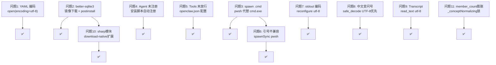

# OpenRY Windows 适配测试报告

> **日期**：2026-08-06 ~ 2026-08-07  
> **环境**：Windows 11 + Node.js v24.14.1 + Python 3.14 + PowerShell 7  
> **目的**：让 OpenRY 在 Windows 上一键安装并正常运行 workflow

---

## 一、发现的全部问题及修复方案

### 问题 1：YAML 文件编码 → `charmap codec can't decode`

**现象**：运行 workflow 时 `open()` 报 `'charmap' codec can't decode byte 0x8d`

**根因**：`yaml_loader.py`、`validation.py`、`cli.py` 的 `open(path)` 未指定 `encoding="utf-8"`。Windows 默认 ANSI 代码页（`cp936`/`cp1252`）无法解码 UTF-8 文件。

**修复**（已由上游合入）：所有 `open(path)` → `open(path, encoding="utf-8")`

---

### 问题 2：better-sqlite3 原生模块缺失 → Patrol 巡查循环无法启动

**现象**：workflow 创建后永远停在 `queued` 状态

**根因**：`better-sqlite3` 是 C++ native 模块，`npm install` 时需从 **GitHub Releases** 下载预编译 `.node` 二进制。国内网络 GitHub 不通 → 下载超时 → 二进制文件缺失 → `openDb()` 抛异常 → `createOrchestratorService().start()` 失败 → Patrol 巡查循环未启动。

**错误日志**：
```
[orchestrator-plugin] start FAILED: Error: Could not locate the bindings file.
Tried: ...\better-sqlite3\lib\binding\node-v137-win32-x64\better_sqlite3.node
```

**修复（安装脚本层面，不改源码）**：

1. `npm install --ignore-scripts` — 跳过原生模块的 postinstall 下载
2. 新增 `orchestrator-plugin/scripts/download-native.mjs` — 从镜像站下载 `.node`
3. `package.json` 加 `"postinstall": "node scripts/download-native.mjs || true"`
4. `install.ps1` / `install.sh` 同步更新

**镜像站池**（按优先级）：
```
ghfast.top → ghproxy.com → mirror.ghproxy.com → github.moeyy.xyz → gh.con.sh
```

**涉及文件**：
- `orchestrator-plugin/scripts/download-native.mjs` 🆕
- `orchestrator-plugin/package.json` — 加 `postinstall`
- `install.ps1` — `npm install --silent` → `npm install --ignore-scripts` + 手动调用下载
- `install.sh` — 同上

---

### 问题 3：`spawn()` 无法执行 `.cmd` 文件 → exit_code=-4058

**现象**：`commands_log` 中 `exit_code=-4058`, `duration_ms=0`

**根因**：`patrol.ts` 中 `spawn('openclaw', [...])` 直接调用。Windows 上 `openclaw` 是 `openclaw.cmd`，Node.js `spawn()` 不带 `shell:true` 无法直接执行批处理文件。

**错误日志**：
```
[orchestrator] dispatched run xxx (step=step_greet)
[orchestrator] run xxx completed (exit -4058)
```

**修复方向**：创建跨平台 spawn 工具 `spawn-helper.ts`

```
⚠️ 关键决策：必须用 pwsh（PowerShell 7），严禁用 cmd.exe！
```

理由：
- `pwsh` 单引号 `'...'` 是字面量字符串（和 Unix `sh` 行为一致）
- `cmd.exe` 不认单引号，导致后续 JSON payload 被空格截断
- `install.ps1` 已确保用户安装了 PowerShell 7

**修复要点**：
- Windows：`spawn('pwsh', ['-NoProfile', '-NonInteractive', '-Command', flatArgs], ...)`
- Unix：`spawn(command, args, ...)` 保持不变
- PATH 构建：`buildPath()` — Windows 用 `;` 分隔，Unix 用 `:`

**涉及文件**：
- `orchestrator-plugin/src/orchestrator/spawn-helper.ts` 🆕
- `orchestrator-plugin/src/orchestrator/patrol.ts` — 所有 `spawn()` 改用 `spawnOpenclaw()` + `buildPath()`

---

### 问题 4：Agent 未注册 → `Unknown agent id "openry-worker"`

**现象**：`cmd.exe /c openclaw agent --agent openry-worker` → `Unknown agent id`

**根因**：`install.sh` 只打印提示让用户手动加 agent，`install.ps1` 完全没有 agent 注册逻辑。

**修复**：安装脚本中新增：
1. 创建 agent workspace 目录 + `AGENTS.md`
2. `openclaw agents add openry-worker --workspace <path> --non-interactive`

**涉及文件**：`install.ps1`、`install.sh`

---

### 问题 5：Agent tools 未放行 → Agent 找不到 openry_run/openry_status

**现象**：AI agent 回复 > "我在当前可用的工具列表中没有找到 openry_status"

**根因**：`openry-worker` agent 缺少 `tools` 配置，OpenClaw 默认不放行插件注册的自定义工具。

**修复**：在 `openclaw.json` 中为 `openry-worker` agent 写入：
```json
"tools": {
    "profile": "minimal",
    "alsoAllow": [
        "openry_run",
        "openry_status",
        "openry_payload_query",
        "openry_knowledge_query"
    ]
}
```

**涉及文件**：`install.ps1`、`install.sh`（agent 注册后自动写入）

---

### 问题 6：Shell 引号不兼容 → `payload must be valid JSON`

**现象**：Agent 调用 `openry_status` 传 `{"message":"test"}` 时报错

**根因**：`index.ts` 中 `openry_status` 工具用单引号包裹 JSON 传给 `execSync()`：
```typescript
execSync(`${OPENRY_CLI} --status ${status} --payload '${payloadJson}'`, ...)
```
Node.js 的 `execSync` 在 Windows 内部用 `cmd.exe /c` 执行。`cmd.exe` 不认单引号，JSON 中的空格被当作参数分隔符，Python CLI 收到被截断的字符串无法解析。

**修复方向**（依赖问题 3 的 pwsh 方案）：
```typescript
// 用 pwsh 包裹执行 — pwsh 单引号行为和 Unix sh 一致
execSync(`pwsh -NoProfile -Command "openry --status ${status} --payload '${payloadJson}'"`, ...)
```

或者**环境变量方案**（更彻底）：
```typescript
// TypeScript — 通过环境变量传 JSON，完全绕过 shell
execEnv.OPENRY_PAYLOAD = payloadJson;
execSync(`openry --status ${status} --payload-stdin`, { env: execEnv });
```
```python
# Python — 从环境变量读取
if args.payload_stdin:
    payload_str = os.environ.get("OPENRY_PAYLOAD", "{}")
```

**涉及文件**：`orchestrator-plugin/src/index.ts`（`openry_status` 和 `openry_run` 工具）

---

### 问题 7：stdout 编码 → `charmap codec can't encode character '\u2705'`

**现象**：Agent 返回含 emoji 的结果后，`openry_status` 报 `UnicodeEncodeError: 'charmap' codec can't encode character '\u2705'`

**根因**：`cli.py` 中 `print(json.dumps(result, ensure_ascii=False))` 输出到 stdout。Windows 默认 stdout 编码为 `cp1252`，无法编码 emoji 等 UTF-8 字符。

**错误日志**：
```
File "C:\Python314\Lib\encodings\cp1252.py", line 19, in encode
    return codecs.charmap_encode(input,self.errors,encoding_table)[0]
UnicodeEncodeError: 'charmap' codec can't encode character '\u2705' in position 265
```

**修复**：在 `main()` 入口添加 stdout 重配置（仅 Windows）：
```python
if sys.platform == "win32":
    sys.stdout.reconfigure(encoding="utf-8")
```

**涉及文件**：`openry/cli.py` — `main()` 函数

---

### 问题 8：命令输出编码 → 中文变问号

**现象**：Agent 执行 `date` 等命令后，payload 中的中文字符变成 `?`，如 `2026?8?7?`

**根因**：`utils.py` 的 `safe_decode()` 使用 `sys.getfilesystemencoding()`（Windows = `cp1252`）解码子进程输出。pwsh 输出的是 UTF-8，`cp1252` 无法解码中文 → surrogate 字符 → `json.dumps` 替换为 `?`。

**修复**：UTF-8 优先尝试，失败时降级到系统编码（添加式，不影响 Unix）：
```python
def safe_decode(data: bytes) -> str:
    try:
        return data.decode("utf-8")
    except UnicodeDecodeError:
        return data.decode(sys.getfilesystemencoding(), errors="surrogateescape")
```

**涉及文件**：`openry/utils.py` — `safe_decode()`

**⚠️ 补充修复**：仅 `safe_decode` 不够。pwsh 在 stdout 被管道重定向时默认用 ASCII 编码。需用 `[Console]::OutputEncoding`（非 `$OutputEncoding`）强制 UTF-8：
```python
f"[Console]::OutputEncoding = [System.Text.Encoding]::UTF8; {command}"
```

**涉及文件**：`openry/executor.py` — `run_command()` 中 pwsh 调用

---

### 问题 9：Transcript 加载失败 → `Failed to load transcript`

**现象**：前端 Session Transcript 区域显示 "Failed to load transcript"

**根因**：`api_server.py` 中 `_find_session_id()` 和 `_parse_transcript()` 的 `Path.read_text()` 未指定 `encoding="utf-8"`。Windows 默认 cp1252 无法解码含 emoji/CJK 的 JSONL 对话记录。

**修复**：`read_text()` → `read_text(encoding="utf-8")`

**涉及文件**：`openry/server/api_server.py` — `_find_session_id()`, `_parse_transcript()`

---

### 问题 10：`sharp` 原生模块缺失 → Concepts 向量化失败

**现象**：Concepts 列表为空，日志中反复报错：
```
[orchestrator-plugin] agent concept normalization failed for xxx:
Error: Something went wrong installing the "sharp" module
Cannot find module '../build/Release/sharp-win32-x64.node'
```

**根因**：`@xenova/transformers`（BGE-M3 向量化）依赖 `sharp`（图片处理 native 模块）。`npm install --ignore-scripts` 跳过了 `better-sqlite3` 也跳过了 `sharp`，导致 `sharp` 的预编译二进制缺失。`scanAndNormalizeAgentConcepts()` 找到 concepts 后调用 `embed()` → `sharp` 加载失败 → 静默吞错。

**修复**：`download-native.mjs` 扩展为同时处理 `better-sqlite3` 和 `sharp` 两个 native 模块。sharp 使用 N-API v7 命名规则：`sharp-v{ver}-napi-v7-{platform}-{arch}.tar.gz`。

**涉及文件**：`orchestrator-plugin/scripts/download-native.mjs`

---

### 问题 11：`member_count` 膨胀 → Concepts 聚类被重复计数

**现象**：只运行 1 个 hello_world workflow（2 个 agent step），clusters 表的 `member_count` 却是 16 和 8（预期为 1 和 1）。

**根因**：`patrol.ts` 的 `patrol()` 循环（每 5 秒触发）中，`this.scanAndNormalizeAgentConcepts()` **缺少 `await`**：

```typescript
// patrol() 是同步方法，不 await async 函数
this.scanAndNormalizeAgentConcepts(); // ⚠️ fire-and-forget
```

`scanAndNormalizeAgentConcepts` 是 `async`，内部调用 `await normalizeConcepts()` → `await embed()`（BGE-M3 ONNX 推理）。Windows 上 ONNX 只用 CPU EP，模型首次加载 ~20-80 秒，远超 5 秒 patrol 间隔。

**时序**：重叠的 patrol 周期并发查询同一行 task_state（`_core_id` 还没写完），各自调用 `normalizeConcepts()`，每调一次 `member_count += 1`。

**为何 macOS 不出现**：Apple Silicon 有 CoreML EP（ANE/GPU 硬件加速），模型加载 ~2-5 秒 < patrol 间隔，不会重叠。

**修复**：给 `scanAndNormalizeAgentConcepts` 加轻量并发锁（`_conceptNormalizing` 布尔标志），已在途调用时直接跳过。不影响 patrol 整体同步架构，macOS/Linux 零影响。

**涉及文件**：`orchestrator-plugin/src/orchestrator/patrol.ts` — `scanAndNormalizeAgentConcepts()` + `_conceptNormalizing` 字段

**补充**：`install.ps1`/`uninstall.ps1` 同步修复（见问题 6 附）：
- `uninstall.ps1`：Step 6 删除数据前先 `Stop-Process python*` 杀 DB 锁进程，改为逐个删 DB 文件再删目录
- `install.ps1`：Step 6 初始化前清除旧 `openry.db*`，确保每次重装都是干净库

---

## 二、问题关系图



---

## 三、改动文件总览

| 文件 | 操作 | 关联问题 |
|------|------|----------|
| `openry/orchestrator/yaml_loader.py` | 🔧 `open(encoding="utf-8")` | 问题1 |
| `openry/orchestrator/validation.py` | 🔧 `open(encoding="utf-8")` | 问题1 |
| `openry/cli.py` | 🔧 `open(encoding="utf-8")` | 问题1 |
| `openry/cli.py` | 🔧 `sys.stdout.reconfigure(encoding="utf-8")` | 问题7 |
| `openry/server/api_server.py` | 🔧 `read_text(encoding="utf-8")` | 问题9 |
| `openry/executor.py` | 🔧 pwsh 输出强制 UTF-8 | 问题8 |
| `openry/utils.py` | 🔧 `safe_decode()` UTF-8 优先 | 问题8 |
| `orchestrator-plugin/scripts/download-native.mjs` | 🆕 镜像下载 | 问题2 |
| `orchestrator-plugin/package.json` | 🔧 `postinstall` | 问题2 |
| `orchestrator-plugin/src/orchestrator/spawn-helper.ts` | 🆕 跨平台 spawn（**pwsh**） | 问题3 |
| `orchestrator-plugin/src/orchestrator/patrol.ts` | 🔧 spawn + PATH | 问题3 |
| `orchestrator-plugin/src/orchestrator/patrol.ts` | 🔧 `_conceptNormalizing` 并发锁 | 问题11 |
| `orchestrator-plugin/src/index.ts` | 🔧 shell 引号兼容 | 问题6 |
| `install.ps1` | 🔧 安装流程 + DB清理 | 问题2,4,5 |
| `install.sh` | 🔧 安装流程 | 问题2,4,5 |
| `uninstall.ps1` | 🆕 卸载脚本 + 杀进程/DB锁修复 | — |

---

## 四、给后续修复者的提示

```
在 Windows 上适配 OpenRY 时必须遵守以下原则：

1. 🐚 Shell 选择
   Windows 上所有子进程 spawn/exec 必须使用 pwsh（PowerShell 7），
   严禁使用 cmd.exe。pwsh 的单引号行为和 Unix sh 一致。

2. 🛣 PATH 分隔符
   Windows 用 ;  Unix 用 :  buildPath() 工具函数按平台选择。

3. 📝 文件编码
   所有 open() / readFileSync() 必须显式指定 encoding="utf-8"。
   Python 入口 main() 中 sys.stdout.reconfigure(encoding="utf-8")。

4. 📦 原生模块
   better-sqlite3 通过 download-native.mjs 从镜像站下载，
   npm install 必须用 --ignore-scripts。

5. 🤖 Agent 配置
   安装脚本必须自动注册 openry-worker agent 并配置 tools。

6. 🧩 修复方式
   所有修改必须是"添加/扩展/新增"，不动 macOS/Linux 已有逻辑。
   用 process.platform === 'win32' 做平台判断，
   Windows 路径走新分支，Unix 路径保持不变（直接 spawn shebang）。
```
